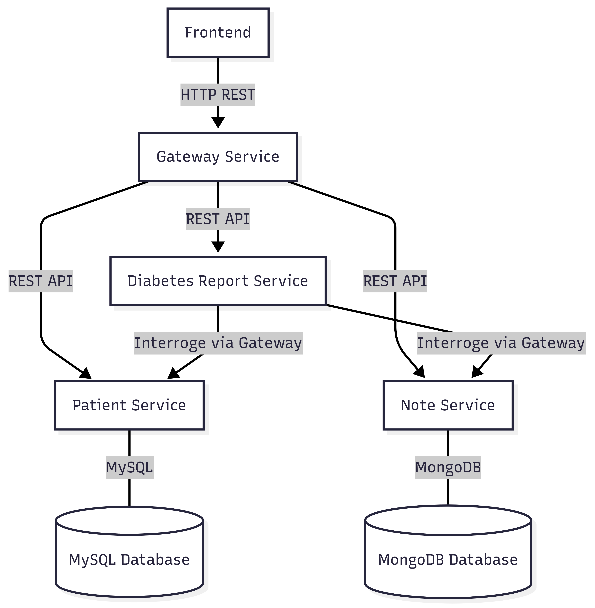

# 🏥 Medilabo

Medilabo est une application web composée de microservices permettant la gestion de patients et de leurs dossiers médicaux. Ce projet est construit avec une architecture orientée microservices, conteneurisée avec Docker.

## 📚 Sommaire

- [Technologies utilisées](#-technologies-utilisées)
- [Description des microservices](#-description-des-microservices)
- [Architecture du projet](#-architecture-du-projet)
- [Authentification via Basic Auth](#-authentification-via-basic-auth)
- [Lancement de l'application](#-lancement-de-lapplication-avec-docker-compose)
- [Endpoints des microservices](#-endpoints-des-microservices)
- [Suggestions d’améliorations (Greencode)](#-suggestions-daméliorations--greencode)

## 🛠 Technologies utilisées

| Catégorie          | Outils / Langages                      |
|--------------------|----------------------------------------|
| 🧠 Backend          | Java 21, Spring Boot, Spring Cloud     |
| 🎨 Frontend         | React, Vite, Axios                     |
| 🗄️ Base de données  | MySQL, MongoDB                         |
| 📋 Logging          | Log4j2                                 |
| 🐳 Orchestration    | Docker, Docker Compose                 |
| 🔐 Authentification | Basic Auth (via Gateway)               |
| ⚙️ Build Tools      | Maven                                  |


## 🧩 Description des microservices

Chaque microservice est responsable d’un domaine métier spécifique, et communique avec les autres via la passerelle (Gateway Service).

| Microservice     | Description                                                                                                                          | Technologies principales                      |
|------------------|--------------------------------------------------------------------------------------------------------------------------------------|----------------------------------------------|
| Gateway Service  | Gère l'authentification, le routage et la sécurité via Basic Auth.                                                                   | Spring Boot, Spring Cloud Gateway      |
| Patient Service  | Gère l'ajout d'un patient et la mise à jour de son dossier avec stockage des données en base MySQL.                                  | Spring Boot, MySQL, JPA, Log4j2               |
| Note Service     | Gère l'ajout de notes de suivi des patients par le praticien (ex : symptômes, antécédents) avec stockage des données en base MongoDB | Spring Boot, MongoDB, Log4j2                  |
| Report Service   | Génère un rapport de risque de diabète pour un patient à partir de son âge, son sexe et les notes du praticien.                      | Spring Boot, Appel REST, Log4j2                |
| Frontend        | Interface utilisateur pour interagir avec les microservices.                                                                         | React, Vite, Axios, React Router               |

## 🏗️ Architecture du projet



## 🔐 Authentification via Basic Auth

L'authentification des requêtes est centralisée dans la **Gateway**, qui agit comme point d'entrée vers l'ensemble des microservices. Cette passerelle est construite avec **Spring Cloud Gateway** et utilise le module de sécurité **Spring Security (WebFlux)** pour filtrer et sécuriser les accès.

### 🛡️ Rôle de la Gateway

La Gateway a plusieurs rôles essentiels :
- Filtrer toutes les requêtes entrantes vers les microservices,
- Appliquer des règles de sécurité (authentification, autorisations),
- Rediriger les requêtes vers le bon microservice selon l’URL.

### 🔐 Authentification Basic

Le système utilise **HTTP Basic Auth**, un mécanisme d’authentification simple où le nom d'utilisateur et le mot de passe sont envoyés dans l’en-tête HTTP de chaque requête. Dans ce projet, un utilisateur unique est défini statiquement au sein de la configuration de sécurité de la Gateway.

### 🌐 Accès via le frontend

Le frontend (développé en React) communique avec les API via cette Gateway. Pour permettre ce dialogue, une configuration **CORS** (Cross-Origin Resource Sharing) a été mise en place. Elle autorise spécifiquement le frontend, hébergé sur `http://localhost:5173`, à interagir avec la Gateway même si celle-ci est sur une autre origine (port différent).


## 🚀 Lancement de l'application avec Docker Compose

### ✅ Pré-requis

- [Docker](https://docs.docker.com/get-docker/) installé
- [Docker Compose](https://docs.docker.com/compose/) installé

### 🛠️ Étapes

1. **Cloner le projet :**

```bash
git clone git@github.com:MarionLz/OC_P9_Medilabo.git
cd OC_P9_Medilabo
```

2. **Lancer tous les services (build + démarrage) :**

```bash
docker-compose up --build
```

3. **Accéder à l'application :**

| Service           | URL                       |
|-------------------|----------------------------|
| 🖥️ Frontend        | [http://localhost:3000](http://localhost:3000) |
| 🌐 Gateway API     | [http://localhost:8080](http://localhost:8080) |
| 🏥 Patient Service | [http://localhost:8081](http://localhost:8081) |
| 📝 Note Service    | [http://localhost:8082](http://localhost:8082) |
| 📄 Report Service  | [http://localhost:8083](http://localhost:8083) |


ℹ️ Pour arrêter les conteneurs, utilisez la commande :

```bash
docker-compose down
```

### 💾 Bases de données

Les bases de données MySQL (pour les patients) et MongoDB (pour les notes) sont automatiquement initialisées avec des scripts au moment du démarrage via Docker. Aucun script manuel n'est requis.

## 📡 Endpoints des microservices

### 🔹 Patient Service (`http://localhost:8081`)
| Méthode | Endpoint                    | Description                         |
|---------|-----------------------------|-------------------------------------|
| GET     | /patients                   | Liste tous les patients             |
| GET     | /patients/{id}              | Détail d’un patient                 |
| POST    | /patients                   | Créer un nouveau patient            |
| PUT     | /patients/{id}              | Modifier un patient existant        |
| GET  | /patients/{id}/demographics | Obtenir l'âge et le sexe du patient |

### 🔹 Note Service (`http://localhost:8082`)
| Méthode | Endpoint               | Description                   |
|---------|------------------------|-------------------------------|
| GET     | /notes/patient/{id}    | Liste des notes d’un patient  |
| POST    | /notes/patient/{id}    | Ajouter une note              |

### 🔹 Report Service (`http://localhost:8083`)
| Méthode | Endpoint                      | Description                            |
|---------|-------------------------------|----------------------------------------|
| GET     | /diabetes-report/patient/{id} | Rapport de risque pour un patient      |


## 🌱 Suggestions d’améliorations – GreenCode

### ♻️ Qu’est-ce que le GreenCode ?

Le GreenCode, ou éco-conception logicielle, désigne l’ensemble des pratiques de développement visant à réduire l’impact environnemental des logiciels.

Cela passe par :
- une utilisation plus sobre des ressources matérielles (CPU, mémoire, réseau, stockage),
- la réduction des traitements inutiles,
- et la limitation du nombre de composants ou d’interactions non nécessaires.

Appliquer le GreenCode ne signifie pas sacrifier la qualité ou les performances, mais plutôt penser efficacité et simplicité à chaque étape du développement.

Dans ce projet, plusieurs actions ont été identifiées pour aligner l’architecture et le code avec ces principes.

### ⚙️ 1. Réduction du nombre de microservices

🔸 **Fusionner `Note Service` et `Patient Service`**

Ces deux services sont fortement couplés : chaque note est directement liée à un patient, et inversement.

Les regrouper permettrait de :
- Réduire les **appels réseau** (moins de trafic, moins de latence),
- Diminuer le nombre de **conteneurs à faire tourner**, ce qui réduit la consommation de **CPU/mémoire**.

📌 **Action** : Regrouper les entités `Patient` et `Note` dans un seul microservice.

➡️ Cela suit une logique GreenCode : **moins de fragmentation = moins de charge**.


### 🧠 2. Réduction des appels interservices

🔸 **Optimiser la communication entre le Report Service et le service PatientRecord (fusion de Patient + Note)**

Même après la fusion des microservices, le Report Service doit toujours interroger un autre service pour récupérer les données nécessaires.

Pour limiter davantage les appels réseau, on pourrait :
- **Éviter les requêtes multiples** côté Report,
- **Réduire la quantité de données transférées** au strict nécessaire.

📌 **Actions proposées** :
- Ajouter un endpoint d’agrégation dans le service PatientRecord, par exemple :  
  `GET /patient/{id}/full-record` → retourne à la fois les infos du patient **et** ses notes dans une seule réponse.
- Mettre en place une **mise en cache temporaire** dans le Report Service :
    - Les données (patient + notes) sont stockées en mémoire ou via un cache distribué (ex : Redis) pour éviter des appels répétés.
    - Le cache est utilisé tant que les données ne changent pas.

➡️ Cela réduit le **trafic réseau**, les **temps de réponse**, et la **charge sur les services**, en cohérence avec les principes du GreenCode.

### 🐳 3. Optimisation Docker (GreenCode)

#### ✅ Ce qui est déjà mis en place

- **Build multi-étapes**  
  La compilation se fait dans une image Maven, puis seule l’application compilée (JAR) est copiée dans une image d’exécution légère (`eclipse-temurin:21-jre-alpine`).  
  → Image finale plus légère, déploiement plus rapide et économie d’espace disque.

- **Image d’exécution Alpine**  
  Utilisation d’une image Alpine (environ 60 Mo) au lieu d’une image Debian plus lourde.  
  → Réduction de la taille de l’image, consommation mémoire et temps de démarrage optimisés.

- **Gestion dédiée des logs**  
  Création d’un répertoire de logs (`/notesService/logs`) permettant potentiellement le montage d’un volume externe.  
  → Limite l’écriture dans le conteneur et facilite la gestion des fichiers de logs.

- **Tests exclus du build de production**  
  La commande Maven inclut l’option `-DskipTests` pour ne pas exécuter les tests lors de la construction de l’image finale.  
  → Gain de temps et de ressources CPU lors du build.

---

#### 🔧 Améliorations possibles

- **Limiter les ressources des conteneurs**  
  Ajouter dans le fichier `docker-compose.yml` des paramètres comme :
  ```yaml
  mem_limit: 512m
  cpu_shares: 512
  ```
  → Permet de restreindre la mémoire et le CPU utilisés par chaque conteneur, évitant ainsi une consommation excessive.


- **Nettoyer les caches inutiles**  
  Supprimer les fichiers temporaires ou caches Maven dans l’image finale si présents, pour réduire encore la taille.

### 🔍 4. Logging et observabilité

🔸 Le projet utilise Log4j2, ce qui est une bonne pratique pour la gestion des logs. Toutefois, il est important d’optimiser la verbosité des logs pour limiter l’impact sur les performances et la consommation de ressources.

📌 Actions recommandées :
- Réduire le niveau de logs en production, par exemple utiliser le niveau **INFO** plutôt que **DEBUG** ou **TRACE**.
- Configurer la rotation et la taille maximale des fichiers de logs pour éviter une occupation excessive du disque.
- Limiter les logs aux informations essentielles pour l’analyse des performances et le débogage, afin d’éviter les données superflues.

### 🔐 5. Sécurité et consommation

📌 Actions :
- La Basic Auth est simple, mais nécessite des en-têtes d’authentification dans chaque requête, ce qui alourdit légèrement le trafic.
- À terme, envisager une solution plus légère ou stateless (JWT) qui évite les échanges superflus.

### 📉 6. Mesure de l’impact énergétique

📌 Actions recommandées :
- Intégrer des outils de mesure de l’empreinte énergétique tels que :
- **GreenFrame.io** pour évaluer l’empreinte carbone du frontend et du backend.
- **Scaphandre** pour monitorer la consommation des conteneurs Docker ou des systèmes Linux.

🔹 Ces outils permettent de quantifier précisément l’impact des optimisations en termes de consommation d’énergie et d’émissions carbone.


---

Merci de votre lecture et bonne exploration ! 🌿